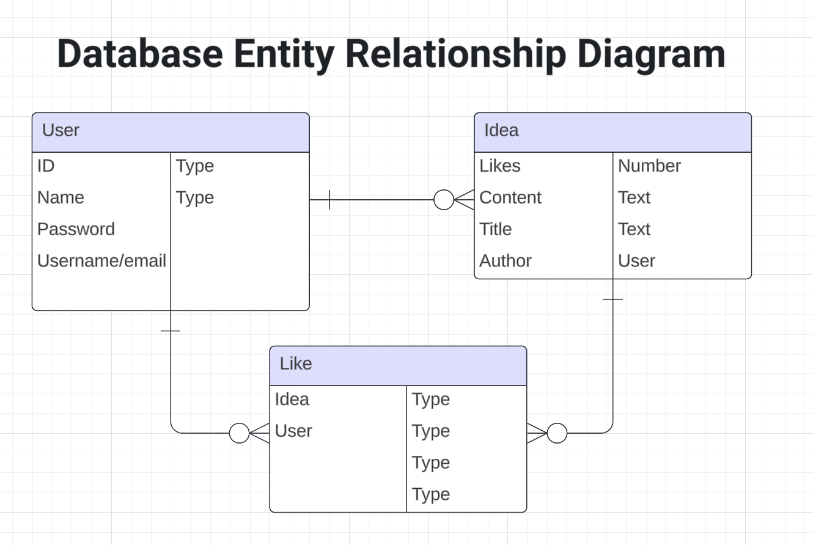
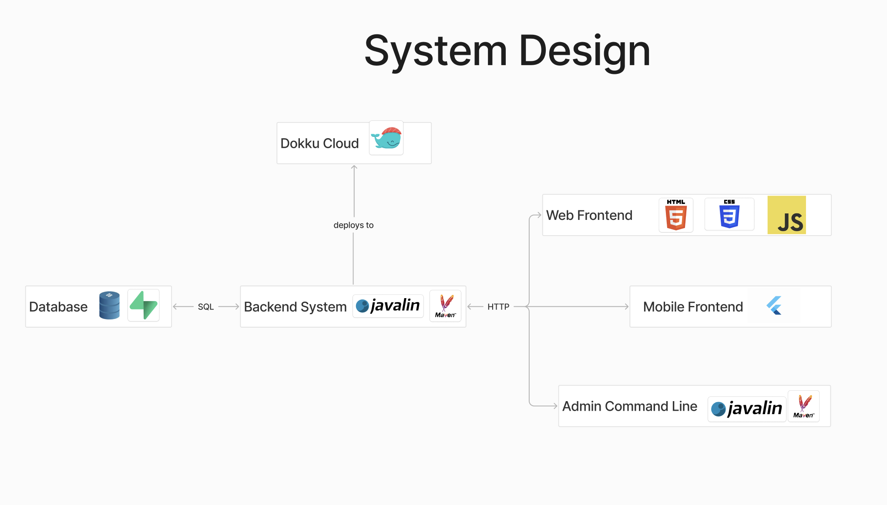

# **User Stories for The Buzz**
Anonymous User Stories
As an anonymous user, I want to view a list of ideas so that I can see what others are sharing.
As an anonymous user, I want to post a new idea so that I can share my thoughts with others.
As an anonymous user, I want to like an idea so that I can show my appreciation for it.
As an anonymous user, I want to remove my like from an idea if I change my mind.
As an anonymous user, I want to see the number of likes on each idea to gauge its popularity.
Admin User Stories
As an admin, I want to view all ideas in the system so that I can monitor content.
As an admin, I want to delete inappropriate ideas to maintain a positive community environment.
As an admin, I want to create new database tables to support future features.
As an admin, I want to drop database tables that are no longer needed.
As an admin, I want to remove specific entries from database tables to manage data accurately.

ERD

System Design

