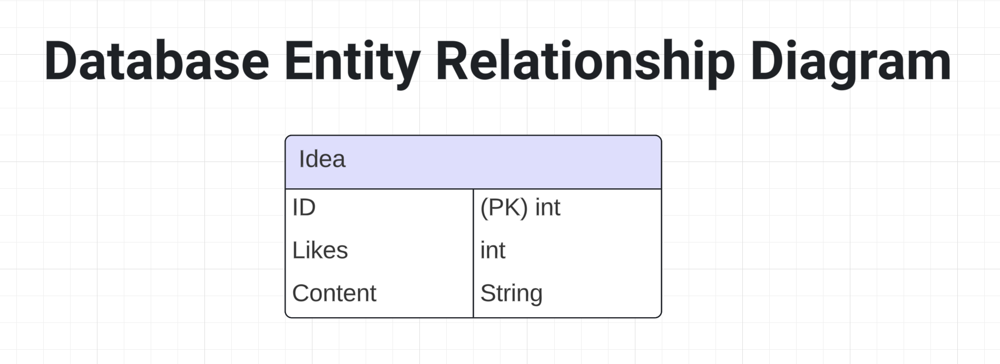

# **User Stories for The Buzz**
## Anonymous User Stories

- **As an anonymous user, I want to view a list of ideas so that I can see what others are sharing.**
- **As an anonymous user, I want to post a new idea so that I can share my thoughts with others.**
- **As an anonymous user, I want to like an idea so that I can show my appreciation for it.**
- **As an anonymous user, I want to remove my like from an idea if I change my mind.**
- **As an anonymous user, I want to see the number of likes on each idea to gauge its popularity.**

## Admin User Stories

- **As an admin, I want to view all ideas in the system so that I can monitor content.**
- **As an admin, I want to delete inappropriate ideas to maintain a positive community environment.**
- **As an admin, I want to create new database tables to support future features.**
- **As an admin, I want to drop database tables that are no longer needed.**
- **As an admin, I want to remove specific entries from database tables to manage data accurately.**
# **ERD**

# **System Design**


# API Routes for The Buzz

1. **GET /ideas**
   - **Purpose**: Retrieve a list of all ideas
   - **Response Format**: JSON array of idea objects
     ```json
     [
       {
         "id": "string",
         "content": "string",
         "likes": number,
         "timestamp": "string (ISO 8601 format)"
       }
     ]
     ```

2. **POST /ideas**
   - **Purpose**: Create a new idea
   - **Request Format**: JSON object
     ```json
     {
       "content": "string (max 512 characters)"
     }
     ```
   - **Response**: 201 Created with the created idea object

3. **POST /ideas/:id/like**
   - **Purpose**: Like an idea
   - **Response**: 200 OK with updated idea object

4. **DELETE /ideas/:id/like**
   - **Purpose**: Remove like from an idea
   - **Response**: 200 OK with updated idea object

5. **DELETE /ideas/:id (Admin only)**
   - **Purpose**: Delete an idea
   - **Response**: 204 No Content

6. **GET /admin/ideas (Admin only)**
   - **Purpose**: Retrieve all ideas, including hidden ones
   - **Response Format**: Same as GET /ideas, but includes hidden ideas

7. **POST /admin/tables (Admin only)**
   - **Purpose**: Create a new database table
   - **Request Format**: JSON object with table schema
   - **Response**: 201 Created

8. **DELETE /admin/tables/:tableName (Admin only)**
   - **Purpose**: Drop a database table
   - **Response**: 204 No Content

9. **DELETE /admin/tables/:tableName/:entryId (Admin only)**
   - **Purpose**: Remove a specific entry from a table
   - **Response**: 204 No Content

