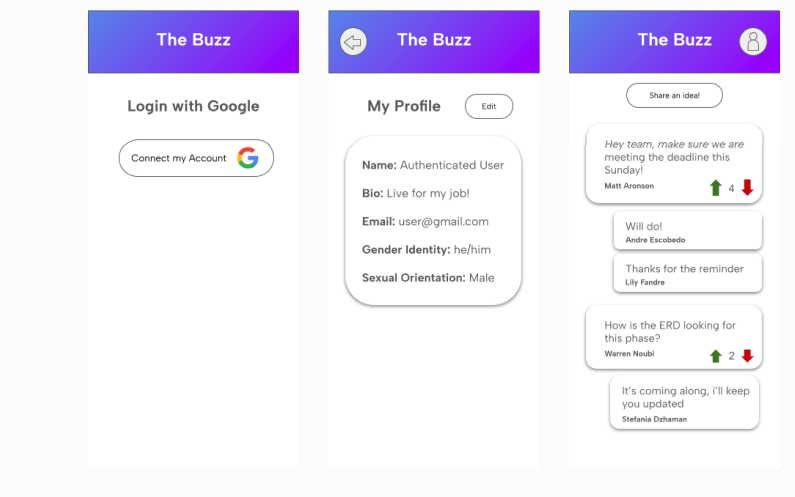
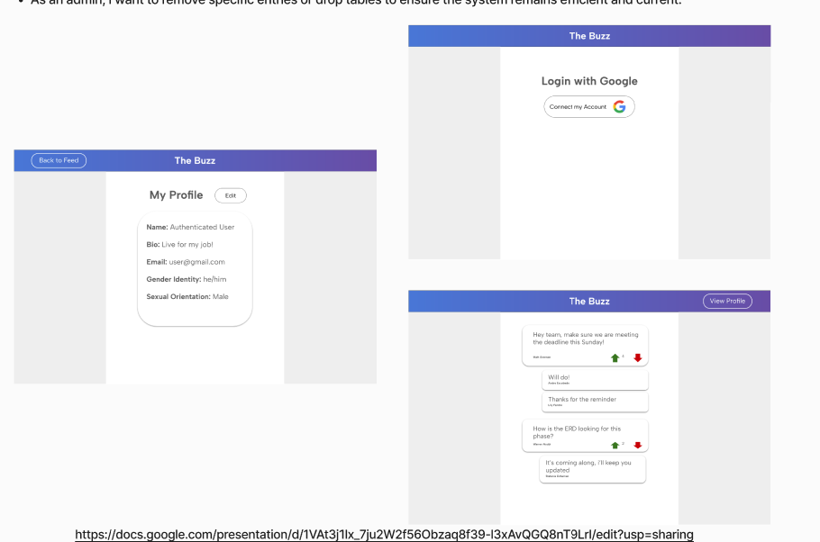
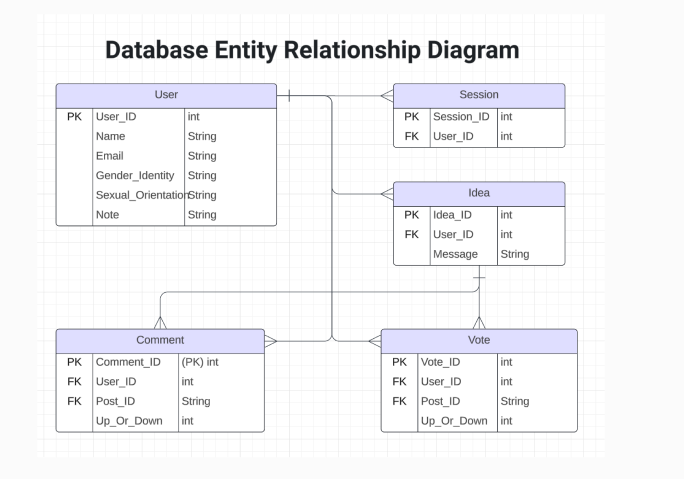
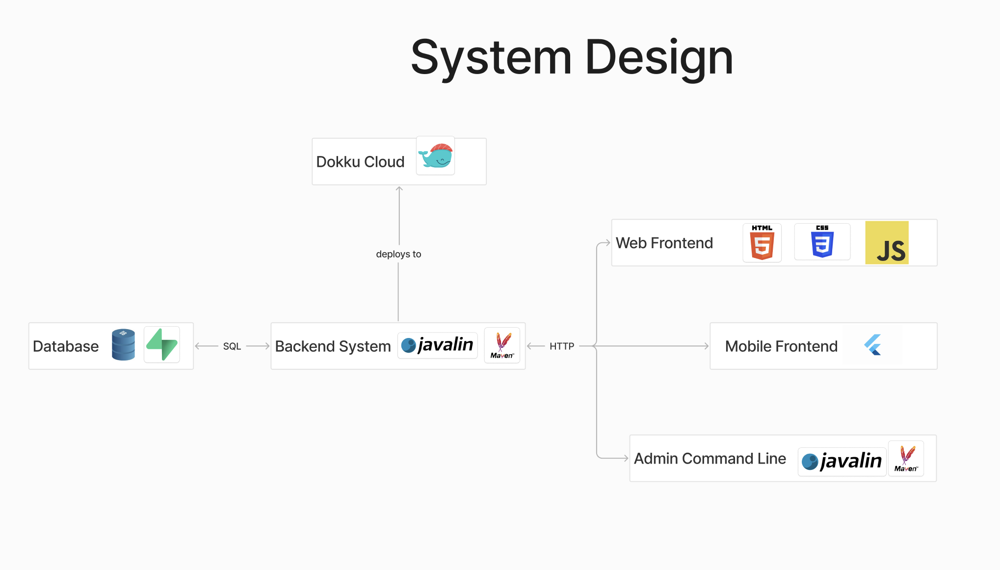
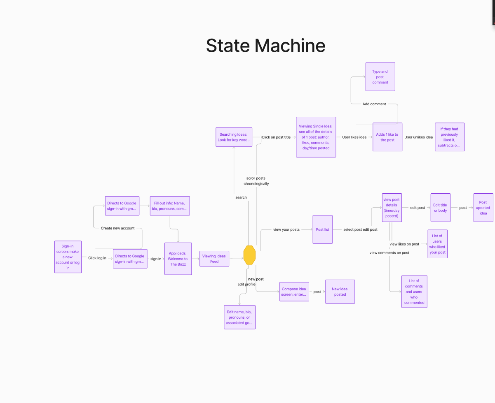
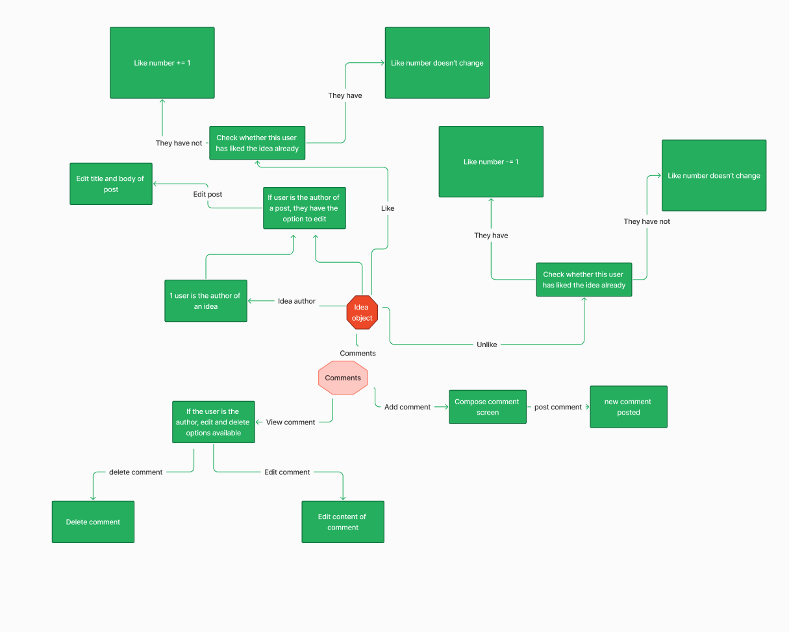

# The Buzz - Phase 2 Documentation

## Table of Contents

1. [User Stories](#user-stories)
2. [User Story Tests](#user-story-tests)
3. [System Architecture](#system-architecture)
4. [UI/UX Design](#uiux-design)
5. [State Machines](#state-machines)
6. [API Routes](#api-routes)
7. [Database Design](#database-design)
8. [Testing Strategy](#testing-strategy)
9. [Technical Backlog](#technical-backlog)

## User Stories

### Authenticated User Stories

#### As an authenticated user, I want to log in with my Lehigh Google account so that I can access The Buzz securely

- **Given** I have a Lehigh email account
- **When** I click "Sign in with Google"
- **Then** I should be redirected to Google's authentication page
- **And** after successful authentication, I should be redirected back to The Buzz

#### As an authenticated user, I want to up-vote or down-vote ideas so that I can express my opinion

- **Given** I am logged in
- **When** I click the up-vote or down-vote button on an idea
- **Then** my vote should be recorded
- **And** the vote count should update accordingly
- **And** I should see my vote reflected in the UI

#### As an authenticated user, I want to add comments to ideas so that I can contribute to the discussion

- **Given** I am logged in
- **When** I add a comment to an idea
- **Then** my comment should appear under the idea
- **And** other users should be able to see my comment

#### As an authenticated user, I want to edit my profile information so that I can control my identity on the platform

- **Given** I am logged in
- **When** I update my profile information
- **Then** my changes should be saved
- **And** other users should see my updated information

### Admin Stories

#### As an admin, I want to invalidate inappropriate ideas so that I can maintain community standards

- **Given** I am logged in as an admin
- **When** I mark an idea as invalid
- **Then** the idea should no longer be visible to users

#### As an admin, I want to invalidate user accounts so that I can prevent misuse of the platform

- **Given** I am logged in as an admin
- **When** I invalidate a user account
- **Then** that user should no longer be able to log in

#### As an admin, I want to manage database tables so that I can maintain the system effectively

- **Given** I am using the admin CLI
- **When** I run table management commands
- **Then** I should be able to create, modify, and populate tables

## User Story Tests

    Unit tests: mobile
    Test #1: Posting comments: ensure that comments appear on the mobile page by posting a test post and waiting for the comment to appear, which should happen almost immediately.
    Test #2: Verify that users can up vote and down vote by committing this action and waiting for a response in the form of the number of likes changing on the mobile page.
    Test #3: Test profile editing by changing the user’s bio (note) after account creation.

    Admin-cli tests
    Test #1: Inputting a blank post title or post body causes a message prompting the user to input text to appear, and the message does not post

    Test #2: Inputting a blank comment causes message to appear and comment to not post

    Test #3: Attempting to post comment of over 200 chars results in message to the user and comment doesn’t post

    Test #4: Inputting bio of over 200 chars or name of user of over 40 chars causes error message and prompts user to retry

    Unit Tests: Frontend
    Test#1 OAuth Test: Open the login page of the web use a verified userID, have it click through the credential process, confirms it and sends the user to see the comments page

    Test#2: Adding and Editing Comment of the Idea field, tests by creating a comment more than 512 characters, rejects its, add valid input of less than 512 characters. Once confirmed, it will edit it and save it. 

    Test#3: Changing user bio manually. Log in with credentials, open the bio page of the test User and then edit  the bio through the web.

    Unit Tests: Backend
    Test #1: Upvotes/downvotes:  POST/PUT/GET/DELETE upvotes/downvotes reflected in Supabase. Clicking upvote when already upvotes makes it neutral, downvoting when upvoted/upvoting when downvoted replaces previous vote.

    Test #2: Comments: POST/PUT/GET/DELETE  comments reflected in Supabase.

## UI/UX Design

# **DataBase**

# **System Design**

# **State Machine**

## IdeaState

## API Routes

<!-- Add your API routes details here -->
